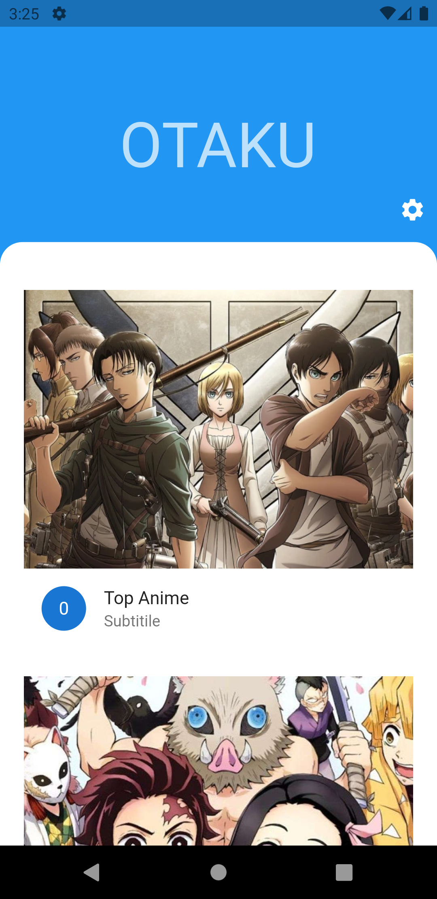
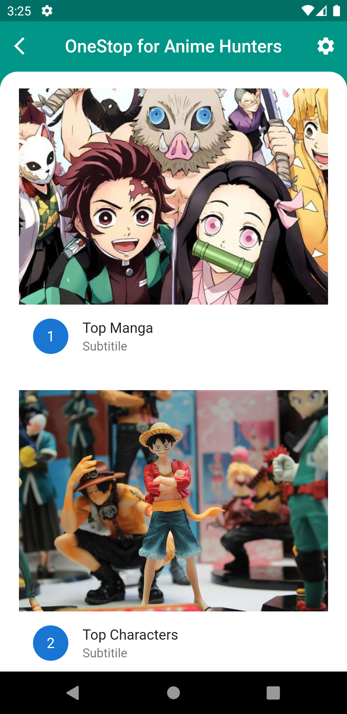
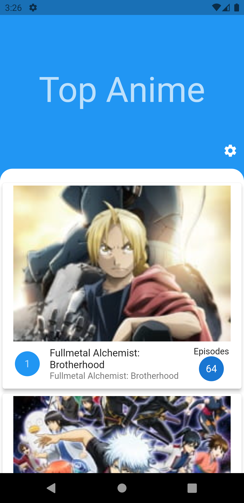
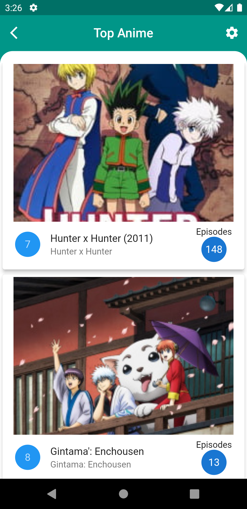

# Otaku

A simple Anime explorer app built with a goal of implementing API knowledge with a cleaner UI.

## Key Points

- Built with **Flutter & Dart** on the frontend using **Material UI**
- **Jikan-API** for getching the details about Anime like TopAnime, TopManga, Top Characters, etc
- Made with an aim to incoperate various **Flutter Widgets** & display proficiency in Flutter & Dart internals

## ScreenShots

 |  | 
 |  | 

## Created & Maintained by

### **Amartya Yadav**
---
